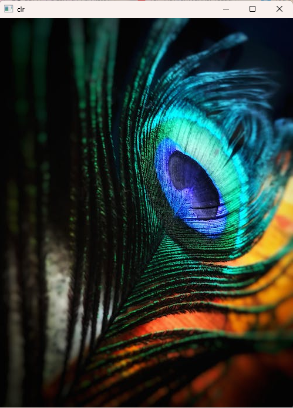

# Histogram and Histogram Equalization of an image
## Aim
To obtain a histogram for finding the frequency of pixels in an Image with pixel values ranging from 0 to 255. Also write the code using OpenCV to perform histogram equalization.

## Software Required:
Anaconda - Python 3.7

## Algorithm:
### Step1:
Read the gray and color image using imread()

### Step2:
Print the image using imshow().

### Step3:
Use calcHist() function to mark the image in graph frequency for gray and color image.

### Step4:
cv2.equalize() is used to transform the gray image to equalized form.

### Step5:
The Histogram of gray scale image and color image is shown.

## Program:
```python
# Developed By:poojithasetty
# Register Number:212221240050
```
import cv2
import matplotlib.pyplot as plt

# Write your code to find the histogram of gray scale image and color image channels.
```
im = cv2.imread("sheep.png",0)
cv2.imshow("box.jpeg",im)
cv2.waitKey(0)
cv2.destroyAllWindows()

hist = cv2.calcHist([im],[0],None,[256],[0,255])
# Colour Image
im_c = cv2.imread("box.jpeg",1)
cv2.imshow("clr",im_c)
cv2.waitKey(0)
cv2.destroyAllWindows()

hist_c = cv2.calcHist([im_c],[1],None,[256],[0,255])
```


# Display the histogram of gray scale image and any one channel histogram from color image
```
import cv2
import matplotlib.pyplot as plt
plt.figure()
plt.title("Histogram of B/W Image")
plt.xlabel("GrayScale Values")
plt.ylabel("Pixel Count")
plt.stem(hist)
plt.show()

plt.figure()
plt.title("Histogram of B/W Image")
plt.xlabel("GrayScale Values")
plt.ylabel("Pixel Count")
plt.stem(hist_c)
plt.show()
```


# Write the code to perform histogram equalization of the image. 
```
gray_image = cv2.imread('sheep.png',0)
equ=cv2.equalizeHist(gray_image)
cv2.imshow('Gray image',gray_image)
cv2.imshow('Equalized Image',equ)
cv2.waitKey(0)
cv2.destroyAllWindows()


```
## Output:
### Input Grayscale Image and Color Image


### Histogram of Grayscale Image and any channel of Color Image


### Histogram Equalization of Grayscale Image


## Result: 
Thus the histogram for finding the frequency of pixels in an image with pixel values ranging from 0 to 255 is obtained. Also,histogram equalization is done for the gray scale image using OpenCV.
